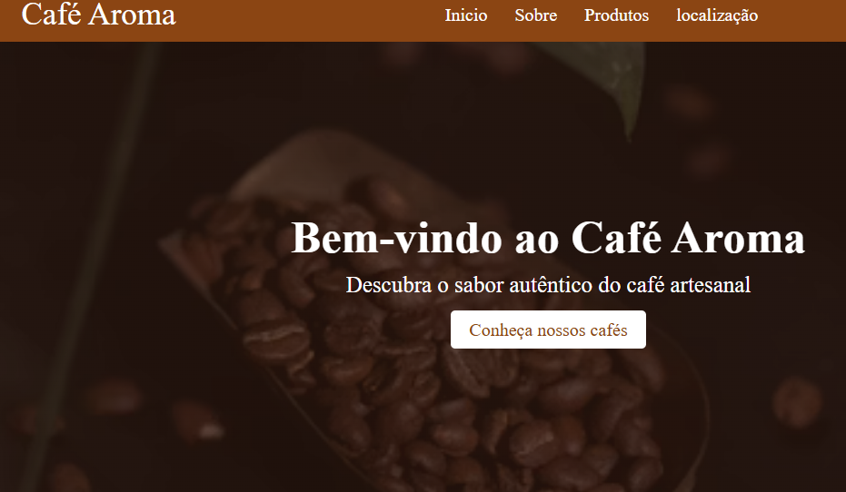

# ☕ Café Aroma

Sistema de cafeteria desenvolvido para praticar HTML, CSS e JavaScript.

## 📸 Demonstração

## 🚀 Funcionalidades

- Exibir produtos
- Adicionar produtos ao carrinho
- Atualizar quantidade
- Remover itens do carrinho
- Calcular total da compra

## 🛠️ Tecnologias

- HTML5
- CSS3
- JavaScript

## 📂 Estrutura do Projeto

├── index.html
├── css/
│ └── style.css
├── js/
│ └── script.js
└── img/

